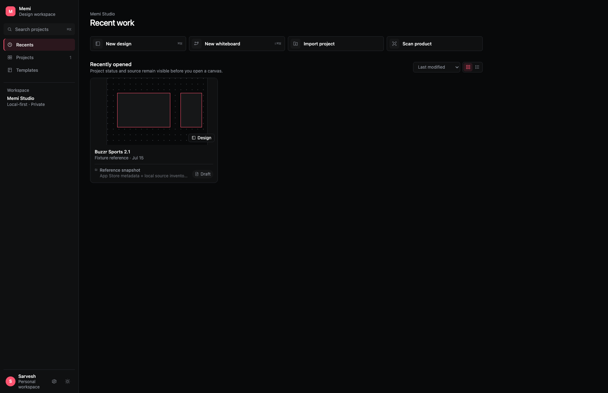
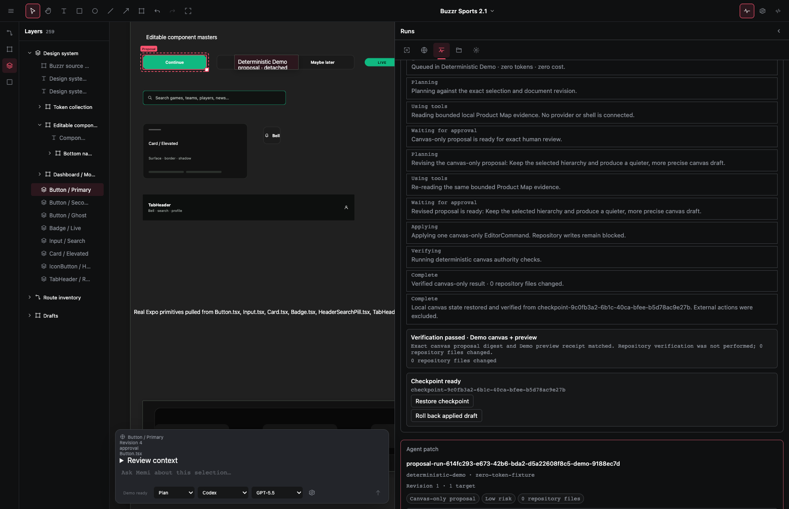
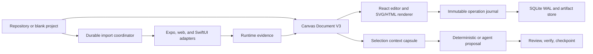

<p align="center">
  
</p>

# memi Canvas

> A local-first, canvas-native design engineering workbench for understanding, creating, and verifying software interfaces with humans and agents.

<p>
  <a href="https://github.com/memi-design/memi-canvas"></a>
  <a href="https://github.com/memi-design/memi-canvas/blob/main/LICENSE"></a>
  
  
</p>

memi Canvas explores an inverse-Figma workflow: start with a real repository or a blank canvas, work visually, and keep every proposed change tied to source evidence, a document revision, and a reviewable trace.

**Public status: In development.** This repository is an open-source M0 development snapshot, not a production release. The editor, canonical document model, durable import jobs, local runtime bridge, and review foundations are implemented and under active convergence. Verified all-screen import, live provider execution, and production source mutation are not complete and are not claimed here.

## Current product

<p align="center">
  
</p>

<p align="center"><sub>Project home and local workspace entry points.</sub></p>

<p align="center">
  
</p>

<p align="center"><sub>The current deterministic M0 review workspace. This screenshot shows demo evidence, not a verified production import.</sub></p>

## Implemented development foundations

| Surface | Current state |
| --- | --- |
| Canvas editor | Selection, camera, shapes, grouping, clipboard, history, pages, inspector, components, and whiteboard foundations |
| Canonical document | Normalized Canvas Document V3 contracts, immutable operations, migration, journals, and SQLite-backed persistence |
| Product map | Searchable routes, screens, components, tokens, flows, evidence, and findings |
| Agent review | Revision-bound context capsules, proposals, approvals, traces, checkpoints, rollback, and recovery using a deterministic demo runtime |
| Repository import | Durable validate → inventory → plan → build → capture → verify contracts, managed worktrees, storage budgets, and platform adapters |
| macOS shell | Tauri 2 application with an authenticated local sidecar, native dialogs, local preview, artifacts, and canvas-document RPC |

The critical missing proof is one real repository screen captured through the importer and reconstructed on the canvas. Until that gate passes, successful tests and synthetic fixtures are engineering evidence—not a production importer claim.

## Quickstart

Requirements:

- macOS 13 or newer
- Node.js 22.12 or newer
- Bun 1.3 or newer for the local runtime sidecar
- Rust stable and the Xcode command-line tools for the native app

```bash
git clone https://github.com/memi-design/memi-canvas.git
cd memi-canvas
npm ci
npm run macos:dev
```

For the browser-only development surface:

```bash
npm run dev
```

The native development command builds a local sidecar launcher and starts the Vite/Tauri application. It does not require administrator privileges. In the development runtime, importing a repository can execute its approved local build recipe inside a Memi-managed worktree; review the displayed recipe before starting an import. This does not make the repository a production importer or enable production source editing.

## Architecture



| Layer | Responsibility |
| --- | --- |
| `apps/web` | React application chrome, project home, canvas workbench, inspector, import UI, and runtime client |
| `apps/macos` | Tauri shell, authenticated runtime transport, native process/file authority, and capture helpers |
| `packages/canvas-document` | Canonical document, operations, migration, persistence, and professional editor semantics |
| `packages/protocol` | Cross-process runtime, import, workspace, trace, and canvas contracts |
| `packages/runtime` | Durable jobs, SQLite stores, source-worktree guards, recovery, and storage policy |
| `packages/capture-*` | Repository inspection, scenario planning, platform execution, artifacts, and import materialization |
| `packages/source-compiler` | Guarded source anchors and deterministic change-set foundations |

The original checkout is treated as read-only during import. Build and capture work happens in Memi-managed worktrees, while screenshots and hierarchies are stored as content-addressed evidence. Source-write machinery remains gated until its security and verification contracts are complete.

## Memi and the wider toolchain

[Memi](https://github.com/memi-design/memi) is the read-only design-engineering audit and skill layer used to evaluate Canvas itself and the repositories Canvas understands.

```bash
npx -y @memi-design/cli@latest diagnose . --json --no-write --fail-on none
```

Memi CLI findings can inform import planning, design-system inventories, and quality gates, but the CLI is not Canvas's document or runtime authority. Canvas remains usable without a Memi account or API key.

The implementation also uses:

- React, TypeScript, Vite, SVG, and HTML overlays for the editor surface
- Tauri and Rust for the macOS shell and private local transport
- Bun and SQLite WAL for the durable local runtime
- Playwright, Vitest, XCUITest, and simulator tooling for verification and capture
- Git-managed worktrees for isolated repository execution

## Verify a checkout

```bash
npm run typecheck
npm run lint
npm run test
npm run build
```

Native and browser E2E gates are available through `npm run verify:full`, but they require the corresponding macOS, simulator, and browser toolchains.

## Status and roadmap

memi Canvas remains **In development**. It is not Figma parity, a hosted collaboration service, a production importer, or a production source editor today. The public development sequence is:

1. Converge every editor action on one immutable document and operation authority.
2. Complete the fast creation surface: layout, text, components, variables, vectors, prototypes, and whiteboarding.
3. Prove one real Buzzr user flow and design-system page through runtime capture—without placeholders.
4. Connect live Codex and Claude adapters through revision-aware proposals and managed worktrees.
5. Pass native recovery, performance, accessibility, security, provenance, and release gates.

See [the convergence release plan](docs/RELEASE_PLAN.md), [program status](docs/PROGRAM_STATUS.md), and [open-source policy](docs/OPEN_SOURCE_POLICY.md) for the detailed boundaries.

## Open source

memi Canvas is independently implemented and licensed under [Apache-2.0](LICENSE). It has no Figma or FigJam runtime, account, plugin, API, private-protocol, or compatibility dependency. Figma, Paper, MagicPath, Onlook, VS Code, Cursor, Codex, and Claude are product references only unless a dependency is explicitly recorded in the [provenance ledger](docs/PROVENANCE_LEDGER.md).

This is an early work in progress. Issues and focused pull requests are welcome once the initial source snapshot is published; please keep claims, screenshots, fixtures, and imported assets evidence-backed and license-safe.
