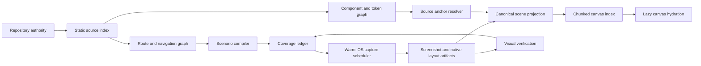

# All-screen repository import architecture

## Outcome

Importing the Buzzr repository must produce a complete, inspectable mobile
product model without asking a person to choose five representative screens.

For the pinned Buzzr revision, the deterministic source pass currently finds:

- 71 Expo Router screen files
- 66 normalized paths
- 116 initial mobile capture scenarios
- 55 scenarios that require dynamic route fixtures
- 365 component source files
- 17 token source files
- 5 existing runtime captures

The static pass completes in about 1.5 seconds on the current development
machine and uses zero model tokens. Runtime capture and native layout
instrumentation, not repository discovery, are now the critical path.

The product must never call an import complete while any planned scenario lacks
a terminal result. Every scenario ends as captured, partial, blocked, failed,
unsupported, or intentionally omitted with a recorded reason.

## Definition of all screens

An app can have unbounded data and interaction states. "All screens" therefore
means all finite, declared product scenarios, not every possible data
permutation.

```text
ScreenScenario =
  route identity
  + auth or persona context
  + dynamic parameter fixture
  + declared UI state
  + feature flag set
  + theme and locale
  + device profile
```

The first Buzzr release slice is:

- every Expo Router screen file
- iOS mobile only
- signed-out context for auth routes
- guest and authenticated contexts for protected routes
- public context for public routes
- one valid fixture for every dynamic parameter set
- explicit loading, empty, error, and populated states when declared by source,
  Maestro flows, fixture manifests, or runtime instrumentation

The initial static expansion is 116 scenarios. State declarations and observed
flows may add scenarios, but they may not silently remove the baseline.

## Product truth and state authorities

| State | Authority |
|---|---|
| Repository source | Read-only pinned checkout during import |
| Route and source graph | Deterministic static compiler output |
| Scenario plan | Versioned route, state, fixture, and device manifests |
| Import jobs and coverage | SQLite WAL runtime |
| Screenshots, layout trees, logs | Content-addressed artifact store |
| Imported semantic projection | Derived cache bound to artifact hashes |
| Canvas arrangement and user drafts | Canonical CanvasDocumentV2 operation log |
| Selection, camera, hover, guides | Memory-only interaction state |
| Original checkout mutation | Separate reviewed source-change workflow |

The screenshot is pixel truth for a runtime state. Measured native layout is
geometry truth. Source anchors are code provenance. No one source is allowed to
claim the other two.

## End-to-end pipeline



### 1. Establish repository authority

The importer records the canonical repository path, full Git revision, dirty
file fingerprint, adapter version, and import-policy version. It reads only
from the pinned checkout. Symlink containment, file count, depth, file size,
and total byte budgets are enforced before parsing.

### 2. Build the static product graph

The zero-token compiler indexes:

- Expo Router files, route groups, dynamic and catch-all parameters
- layouts, redirects, aliases, tabs, stacks, and hidden navigation entries
- source imports and component ownership
- components under both shared and feature-local source directories
- themes, tokens, fonts, icons, and asset references
- state branches that can be proven from source
- Maestro flows and local fixture declarations

This stage emits source anchors and semantic relationships. It does not invent
visual geometry.

### 3. Compile a bounded scenario matrix

Each route becomes one or more deterministic scenario identities. Scenario IDs
are stable hashes of route identity, context, device, state, fixture, flags,
theme, locale, and compiler version.

Dynamic routes are not captured with fake placeholder values. They reference a
fixture requirement. Fixture values come from, in order:

1. a checked-in Memi import fixture manifest
2. a matching Maestro flow
3. a deterministic development seed exposed by the app
4. an observed safe local runtime value
5. a blocked result that tells the user exactly what is missing

Scenario compilation is idempotent. Reimporting the same source and policies
must produce the same identities and ordering.

### 4. Persist the coverage ledger before capture

The complete plan is written before the first simulator launch. This makes a
crash, cancellation, or authentication failure resumable and visible.

Memi uses the existing protocol authorities:

- ProductManifest
- RouteManifest
- StateManifest
- CapturePlan
- CoverageLedger
- ArtifactDescriptor
- CanvasDocumentV2

The Expo adapter may expose a compact summary for the home screen, but the
protocol coverage ledger is the detailed source of truth.

### 5. Run a warmed iOS capture lane

Simulator work is serialized through one owned lane because parallel simulator
boots are slower and less reliable on the target machine. Static parsing,
artifact hashing, image encoding, and projection compilation may run in
parallel.

The lane:

1. boots or reuses one configured simulator
2. starts Metro once and waits for a verified ready signal
3. installs one instrumented development build
4. restores the required auth and fixture context
5. opens the exact route by deep link or internal capture command
6. waits for explicit application readiness, not a fixed sleep
7. records screenshot, layout tree, accessibility tree, source map, logs, and
   timing
8. verifies the expected route and state markers
9. commits artifacts atomically
10. updates the coverage cell and proceeds

The scheduler prioritizes shared shells, auth, tabs, and common components
first. A shared-shell failure can block dependants early instead of wasting
minutes capturing invalid screens.

### 6. Measure real native layout

The inaccurate Buzzr rectangles exist because the current implementation scales
hand-authored semantic boxes over screenshots. Accessibility bounds alone also
merge or omit important visual elements.

The development build receives a capture-only instrumentation transform:

- assign stable element IDs from source path, symbol, AST path, and local key
- record React ownership and component identity
- call native measurement APIs after layout settles
- capture absolute bounds, clipping, z-order, visibility, opacity, transform,
  text metrics, resolved style values, image references, and accessibility
  identity
- associate each measured element with its source anchor and parent
- include scroll offset and safe-area information

The canonical RuntimeSceneArtifactV2 contains:

```text
scenario identity
repository and build fingerprints
device and pixel scale
screenshot artifact
ordered measured native tree
accessibility tree
source anchor table
font and image artifacts
readiness assertions
capture timings
confidence and abstentions
```

Native measurement is geometry authority. The accessibility tree enriches
meaning and interaction semantics. Static source anchors identify editable code.
If these disagree, the projection records a conflict and keeps the screenshot
locked as reference truth.

### 7. Compile identifiable editable scenes

Projection is deterministic and preserves Atomic Design identity:

- source primitives become atoms
- repeated local compositions become molecules
- feature sections become organisms
- shared screen shells become templates
- route and scenario roots become pages

The scene compiler:

1. normalizes device pixels into canvas coordinates
2. reconstructs parent-child hierarchy from measured ownership and clipping
3. matches repeated components by source identity and measured structure
4. binds styles to extracted tokens where equality is proven
5. emits components and instances instead of duplicated loose rectangles
6. marks raster-only or low-confidence regions as locked reference layers
7. attaches screenshot, route, scenario, source, and artifact provenance
8. verifies projected bounds against the screenshot

A visual element may only become directly editable when its geometry and source
identity clear the configured confidence threshold. Memi must abstain instead
of creating a large, misleading selection rectangle.

### 8. Publish a chunked canvas index

The importer does not insert hundreds of screens as thousands of normal canvas
commands. It publishes an immutable import snapshot and a lightweight index:

- route and scenario tree
- terminal coverage status
- thumbnail artifact
- frame bounds
- projection chunk reference
- source and runtime fingerprints

At overview zoom, the renderer shows thumbnails and frame labels only. It
hydrates semantic nodes for visible, selected, or edited screens. Leaving the
area releases derived render data while retaining the immutable artifact.

This keeps the editor fast even when all Buzzr scenarios are present.

## Incremental reimport

Every source file has a content hash and reverse dependency edges to routes,
components, tokens, fixtures, and scenarios.

On a source change:

1. hash only changed paths
2. invalidate affected graph nodes
3. recompile affected scenarios
4. recapture only affected scenarios
5. create new immutable artifacts
6. update the projection index atomically
7. preserve canvas drafts and review conflicts against the new source revision

Changing a shared tab bar invalidates all scenarios that render it. Changing a
single game detail component invalidates only matching routes and states.
Unchanged artifact hashes are reused.

## Runtime and storage boundaries

The Tauri app owns sidecar lifecycle, native paths, file dialogs, and
authenticated renderer transport. The TypeScript runtime owns import jobs,
SQLite transactions, simulator scheduling, artifact indexing, and resumability.

Large artifacts never cross renderer RPC inline. The renderer requests bounded
metadata pages and local artifact handles. Screenshot bytes, layout trees, and
logs remain in the content-addressed store.

One import job may be cancelled between cells. Process groups for Metro,
simulator helpers, and instrumentation are tracked and terminated safely.
Restart resumes from the last committed coverage cell.

## Performance budgets

| Stage | Target |
|---|---:|
| Static inventory p95 | under 5 seconds |
| Current Buzzr static inventory | about 1.5 seconds |
| Cached static reimport | under 500 milliseconds |
| First warm simulator capture | under 15 seconds |
| Additional warmed scenario | under 3 seconds |
| 71-route base capture | under 5 minutes |
| Single affected route reimport | under 5 seconds |
| Home route index render | under 100 milliseconds |
| Canvas thumbnail overview | 55 fps minimum |
| Semantic screen hydration | under 100 milliseconds |
| Pointer-to-visual latency | p95 under 50 milliseconds |
| Base import model tokens | zero |

Capture duration, failure rate, artifact bytes, projection time, and cache hit
rate are emitted as trace events. Performance regressions fail the release gate
instead of being hidden behind a spinner.

## User experience

### Home

The project card shows four separate facts:

- routes discovered
- mobile scenarios planned
- runtime captures completed
- current terminal status

Five captures out of 116 is Syncing, never Ready.

### Import activity

The import view groups work by route family and shows:

- queued, capturing, captured, partial, blocked, failed, unsupported
- current simulator route and state
- elapsed time and estimated remaining work
- fixture, auth, and dependency blockers
- cancel, resume, retry, and reveal-source actions

### Canvas

The left tree is route, state, then semantic layers. It does not flatten every
node in every screen into one enormous layer list.

The canvas initially fits all route families as thumbnail frames. Opening a
screen hydrates its semantic layer tree. Selecting an element highlights the
exact measured bounds, source component, token bindings, and confidence.

## Delivery sequence

### Slice 0: complete static authority

Status: in progress.

- index the full app, components, feature screens, and token sources
- mobile-only scenario planning
- auth-context expansion
- dynamic fixture requirements
- deterministic coverage summary
- truthful home status

Exit gate: every discovered route has at least one stable scenario identity and
the static pass remains below five seconds.

### Slice 1: durable capture orchestration

- persist import job, plan, cells, attempts, and terminal results in SQLite
- add renderer RPC for import status pages and cancellation
- add content-addressed capture artifacts
- implement one warmed iOS simulator lane
- capture one canonical scenario for every route file

Exit gate: all 71 route files have a terminal runtime result after restart and
resume. No result is silently absent.

### Slice 2: exact native geometry

- add development-only source instrumentation
- emit RuntimeSceneArtifactV2
- reconstruct hierarchy from native measurements
- compare projected geometry to screenshot pixels
- replace all hand-authored Buzzr overlays

Exit gate: selection bounds for a benchmark set of text, icons, buttons, list
rows, cards, navigation items, overlays, and scroll content match native bounds
within one canvas pixel after normalization.

### Slice 3: state and fixture expansion

- compile Maestro flows and explicit state manifests
- add loading, empty, error, populated, guest, and authenticated scenarios
- add fixture authoring and blocker resolution UI
- verify navigation coverage

Exit gate: all 116 baseline scenarios plus declared states have terminal
coverage with no silent route or state loss.

### Slice 4: editable component convergence

- bind repeated source components into component definitions and instances
- bind proven tokens
- compile supported canvas edits back into the managed worktree
- recapture and converge the same screen

Exit gate: editing a real Buzzr button, text node, card, and bottom navigation
item produces a verified source patch with zero model tokens.

### Slice 5: scale and hardening

- dependency-driven incremental capture
- projection chunk eviction and prefetch
- crash, disk-pressure, cancellation, stale revision, and secret-redaction tests
- M1 performance traces and visual regression

Exit gate: the full acceptance workflow passes on the M1 benchmark machine and
the exact project state recovers after process termination.

## Test strategy

### Unit and property tests

- route normalization and collision preservation
- context and scenario expansion
- fixture resolution
- deterministic IDs and hashes
- dependency invalidation
- measured-tree normalization
- component instance matching
- coverage summarization
- import snapshot replay

Property tests repeat and reorder equivalent source inputs and require stable
manifests and hashes.

### Integration tests

- real Buzzr checkout static import
- instrumented Expo development build
- Metro and simulator lifecycle
- deep-link and internal route opening
- artifact transaction and corruption handling
- SQLite crash recovery
- RPC pagination and cancellation

### Visual tests

- screenshot and projected bounds overlay
- safe areas and scrolling
- text baselines and wrapping
- icons and images
- clipped and transformed views
- modal, sheet, keyboard, and loading states
- canvas overview and hydrated editing

### Final acceptance

1. Choose the real Buzzr checkout.
2. Verify repository revision and dirty fingerprint.
3. Discover all 71 route files in under five seconds.
4. Produce the full scenario and fixture plan.
5. Resume a previously interrupted import.
6. Capture every runnable mobile scenario through the warmed simulator.
7. Show a terminal reason for every unrunnable scenario.
8. Open the canvas and identify every route family.
9. Select elements whose bounds match the real iOS layout.
10. Edit a source-backed element, recapture it, and converge without a model.
11. Restart the Mac app and recover the exact import, canvas, and review state.

The feature is not complete until this loop passes. A gallery of five
screenshots is evidence for the pipeline, not the product.
